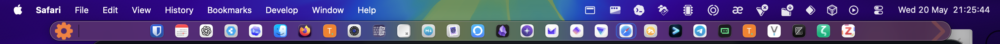
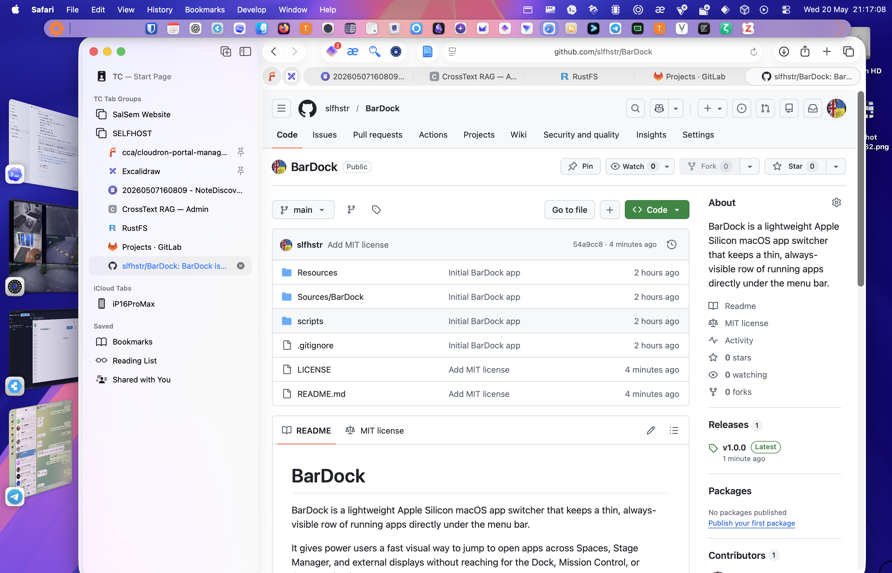

# BarDock

BarDock is a lightweight Apple Silicon macOS app switcher that keeps a thin, always-visible row of running apps directly under the menu bar.

It gives power users a fast visual way to jump to open apps across Spaces, Stage Manager, and external displays without reaching for the Dock, Mission Control, or Command-Tab.

Website: <https://bardock.appx.uk>

Version: 1.0.0

Copyright (c) First Option Limited 2026

License: MIT

## GitHub About

Always-visible macOS app switcher that lives under the menu bar and lets power users jump to running apps across Spaces, Stage Manager, and displays.

## Mac Quarantine

App has been signed, so should install / start cleanly.

If you get a warning, you need to run :
`xattr -dr com.apple.quarantine /path/to/BarDock.app`

## Screenshot




 
## Build

```sh
./scripts/build.sh
```

The built app is written to:

```text
build/BarDock.app
```

## Run

```sh
open build/BarDock.app
```

## Notes

- BarDock is a native AppKit app.
- It stores simple preferences in macOS user defaults.
- It runs as a menu-bar utility app, so it does not appear in the Dock.
- The strip is placed below the menu bar on the current main screen and joins all Spaces.
- The app icon is generated from `scripts/GenerateAppIcon.swift` and stored in `Resources/AppIcon.icns`.
- BarDock is released under the MIT License.
